# Project-II

## Overview
The aim of this project is to be able to draw conclusions from a dataset, and to be able to retrieve information from webpages and estructure them so that it's possible to analyse together with the dataset.

## Introduction
The consummer experience and their principles or apetices can vary depending on how and where they decide to consume. With the rise of Amazon, many independent booksellers have struggled and lost the battle against Goliath to simply exist. But others have been able to survive organising themselves and entering the virtual realm.
This study will try to describe the differences in bestselling books between spanish amazon consuers and spanish independent consumers.

## Datasets
I used two datasets from the kaggle webpage, one with the name _Amazon Top 50 Bestselling Books 2009 - 2022_, in the following [direction](https://www.kaggle.com/datasets/chriskachmar/amazon-top-50-bestselling-books-2009-2022), and the other with the name _"Top Books in Spain: Ranking & Details. 2020 Market Trends in Fiction & Non-Fiction Books"_, in the following [direction](https://www.kaggle.com/datasets/thedevastator/top-books-in-spain-ranking-details), made through scrapping from a page of spanish independent bookshops and their bestsellers of 2023, called [_Todos tus libros_](https://www.todostuslibros.com/mas_vendidos).
Later, another dataset was buildt through web scrapping from this page to get data from 2023.

## Workflow
The libraries used for this study were pandas seaborn, matplotlib.pyplot, and BeautifulSoup from bs4.
I tried to harmonise the different data gathered when possible. There were some variables of interest not available in all the datasets, such as the price of the books.
Once harmonised and cleaned, I started the analysis.

## Hypothesis
Amazon vs Indie bookshops:
- The favourite genre across all plataforms is fiction.
- Bestsellers in indie bookshops were more expensive than bestsellers in amazon.
- The top ten bestsellers in amazon didn't include non-fiction books.
- The top ten bestsellers in indie bookshops included non-fiction books.

Indie bookshops in 2020 and in 2023:
- There were no differences in the top five editorials for both years.
- There were more foreign bestselling publications in 2023.

## Results
### Genres
The proportion of non-fiction books amongst the bestsellers in amazon from 2020 to 2022 is slightly superior than the proportion of fiction books.
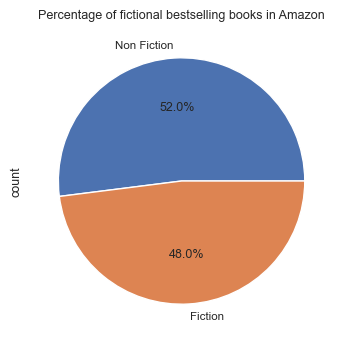
Each year this relation has increased little by little.
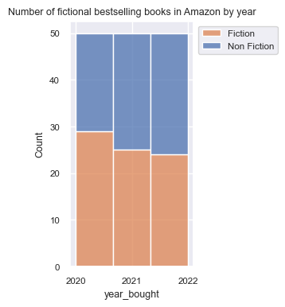
For independent spanish bookshops the proportion of fiction books is clearly superior.
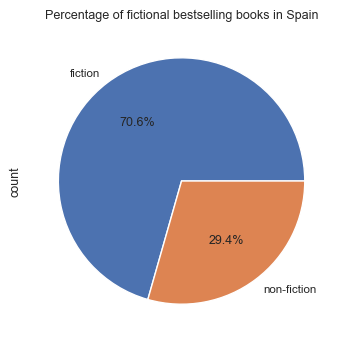
For 2020 and also for 2023.
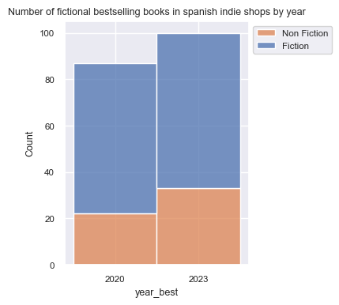
As you will see there are some missings for 2020, because the dataset used had some inclassificable subgenres or wrong values.

However these difference, when we only look at top ten bestsellers, the interest for fiction books is common for all platforms 
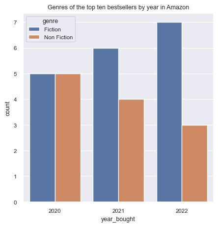
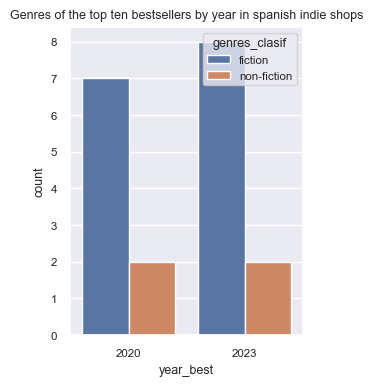

### Prices
The prices of more than 50% bestsellers in amazon are between 5 and 15$
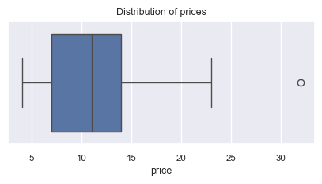
In Amazon these prices haven't changed much during the last years, although they seem to get more expensive after time, but these differences don't look like they will be statistically significant.
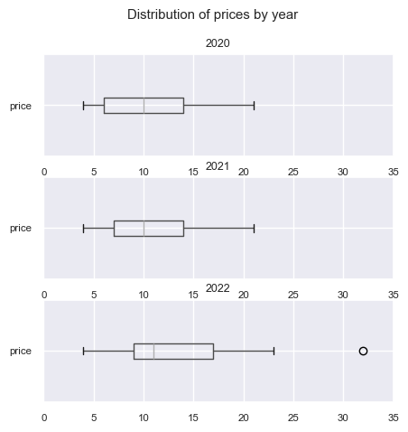
Prices in independent bookshops from Spain seem to be more expensive than those from Amazon.
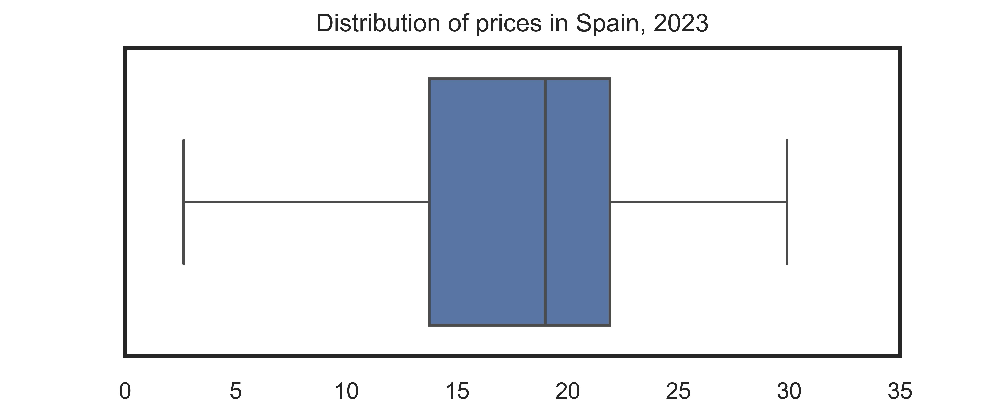

### Spain
#### Editorials
The editorials behind the bestsellers vary across years.
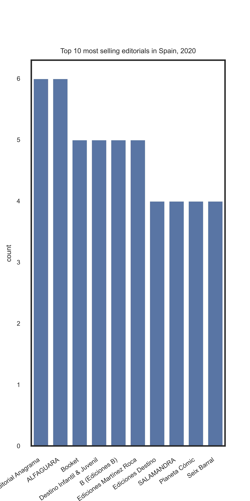
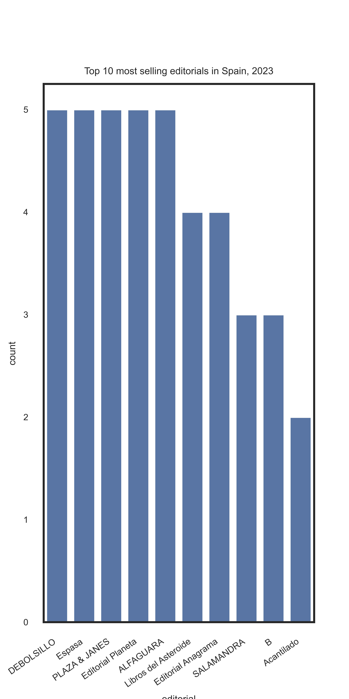

#### Foreign publications
It seems that there is a progression in the consumption of books written by foreign authors
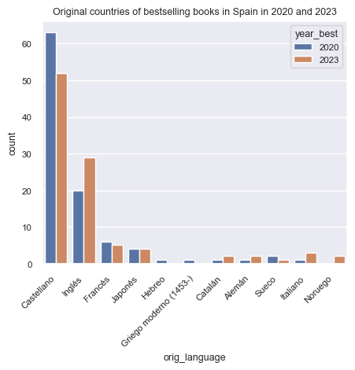

## Conclusion 
- Non-fiction is really popular in Amazon, compared to independent bookshops from Spain, but fiction is still the favourite for the top ten bestsellers.
- Independent bookshops seem to be more expensive than bestsellers in Amazon.
- The editorials behind bestsellers in independent bookshops from Spain varied over time.
- There were more foreign bestselling publications in 2023.

## Other links
[Presentation in Canva](https://www.canva.com/design/DAFyybGA_Ks/wuMPSl_TBy_xq0iMbramPg/edit?utm_content=DAFyybGA_Ks&utm_campaign=designshare&utm_medium=link2&utm_source=sharebutton)